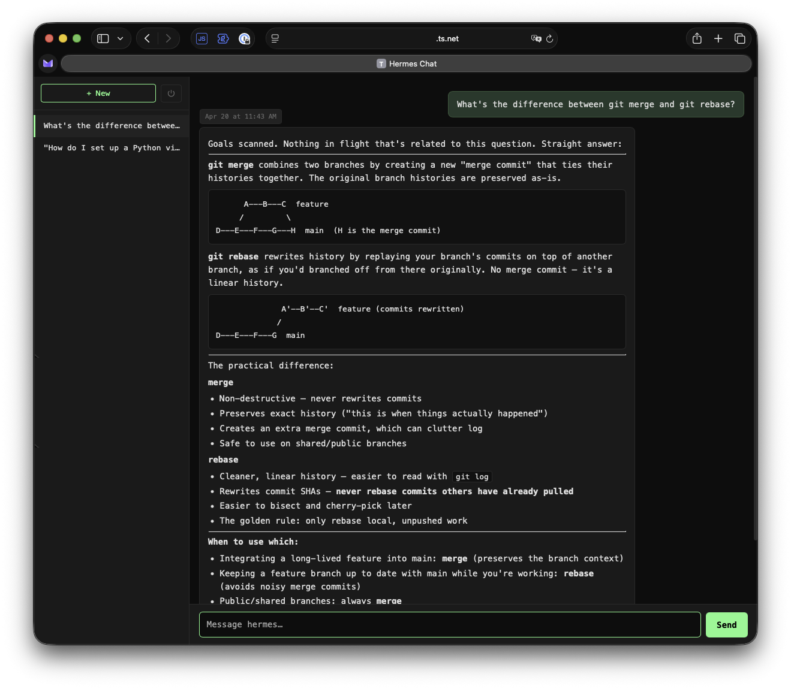

# hermes-proxy

A lightweight chat frontend and reverse proxy for [Hermes Agent](https://github.com/NousResearch/hermes-agent).

Hermes ships with a management dashboard (`:9119`) but no chat UI. hermes-proxy fills that gap: it sits in front of the Hermes `api_server` platform, handles authentication, and serves a minimal browser-based chat interface with session history, SSE streaming, and mobile support.



---

## Features

- Password-gated login with HMAC-signed cookies (30-day session)
- Rate-limited login (5 attempts per 60 seconds)
- SSE streaming with live markdown rendering
- Session sidebar — browse and resume past conversations from `state.db`
- Session continuity across page reloads via `localStorage`
- Session-lost detection — banner prompts if the server restarted and the session mapping was cleared
- Mobile-friendly layout (iOS safe-area, zoom-on-focus fix, slide-out sidebar)
- Timestamp tooltips on message hover
- No build step — vanilla JS, zero frontend dependencies beyond [marked.js](https://marked.js.org/) (bundled)

---

## Prerequisites

- Python 3.9+
- [Hermes Agent](https://github.com/NousResearch/hermes-agent) running with the `api_server` platform enabled
- The Hermes `api_server` API key (from `~/.hermes/config.yaml`)

### Hermes api_server setup

hermes-proxy proxies requests to the Hermes `api_server` platform. Make sure it is enabled in your Hermes config:

```yaml
# ~/.hermes/config.yaml
api_server:
  enabled: true
  port: 8642
  api_key: your-api-key-here
```

Start Hermes normally — the `api_server` platform starts automatically when enabled.

---

## Installation

```bash
git clone https://github.com/XVVH/hermes-proxy.git
cd hermes-proxy
python3 -m venv venv
source venv/bin/activate
pip install -r requirements.txt
```

---

## Configuration

Copy `.env.example` to `.env` and fill in your values:

```bash
cp .env.example .env
```

| Variable | Required | Default | Description |
|---|---|---|---|
| `HERMES_PROXY_PASSWORD` | Yes | — | Password for the web UI login screen |
| `API_SERVER_KEY` | Yes | — | Bearer token for the Hermes `api_server` platform |
| `API_SERVER_URL` | No | `http://127.0.0.1:8642` | URL of the Hermes `api_server` |
| `STATE_DB_PATH` | No | `~/.hermes/state.db` | Path to the Hermes SQLite state database |

**Important:** choose a strong `HERMES_PROXY_PASSWORD`. Rotating it invalidates all existing login cookies automatically (tokens are HMAC-signed against the password).

---

## Running

```bash
source venv/bin/activate
uvicorn server:app --host 127.0.0.1 --port 8643
```

Then open `http://127.0.0.1:8643` in your browser.

For production use, put hermes-proxy behind a TLS-terminating reverse proxy (Caddy, nginx, Tailscale Serve, etc.) — the login cookie is set with `Secure` and `HttpOnly` flags and requires HTTPS.

---

## Running as a background service

### macOS (launchd)

Create `~/Library/LaunchAgents/ai.hermes.proxy.plist`:

```xml
<?xml version="1.0" encoding="UTF-8"?>
<!DOCTYPE plist PUBLIC "-//Apple//DTD PLIST 1.0//EN"
  "http://www.apple.com/DTDs/PropertyList-1.0.dtd">
<plist version="1.0">
<dict>
  <key>Label</key>
  <string>ai.hermes.proxy</string>
  <key>ProgramArguments</key>
  <array>
    <string>/path/to/hermes-proxy/venv/bin/uvicorn</string>
    <string>server:app</string>
    <string>--host</string>
    <string>127.0.0.1</string>
    <string>--port</string>
    <string>8643</string>
  </array>
  <key>WorkingDirectory</key>
  <string>/path/to/hermes-proxy</string>
  <key>RunAtLoad</key>
  <true/>
  <key>KeepAlive</key>
  <true/>
  <key>StandardOutPath</key>
  <string>/tmp/hermes-proxy.log</string>
  <key>StandardErrorPath</key>
  <string>/tmp/hermes-proxy.err</string>
</dict>
</plist>
```

```bash
launchctl load ~/Library/LaunchAgents/ai.hermes.proxy.plist
launchctl kickstart -k gui/$(id -u)/ai.hermes.proxy
```

### Linux (systemd)

Create `/etc/systemd/system/hermes-proxy.service`:

```ini
[Unit]
Description=hermes-proxy chat frontend
After=network.target

[Service]
Type=simple
User=youruser
WorkingDirectory=/path/to/hermes-proxy
ExecStart=/path/to/hermes-proxy/venv/bin/uvicorn server:app --host 127.0.0.1 --port 8643
Restart=on-failure
RestartSec=5

[Install]
WantedBy=multi-user.target
```

```bash
sudo systemctl daemon-reload
sudo systemctl enable --now hermes-proxy
```

---

## HTTPS with Tailscale Serve

If you use Tailscale, you can expose hermes-proxy over HTTPS on your tailnet with a provisioned certificate:

```bash
tailscale serve --bg 127.0.0.1:8643
```

This makes the proxy available at `https://<machine-name>.<tailnet>.ts.net` with a valid TLS cert — no Caddy or nginx required.

---

## Architecture

```
Browser
  │  HTTPS (cookie auth)
  ▼
hermes-proxy (:8643)
  │  Bearer token  │  SQLite read
  ▼                ▼
api_server    state.db
  (:8642)     (~/.hermes/state.db)
  │
  ▼
Hermes Agent
```

- **Auth layer:** HMAC-signed cookies derived from `HERMES_PROXY_PASSWORD`. No server-side token store — cookies are stateless and self-verifying. Rotating the password invalidates all cookies.
- **Session mapping:** The proxy maintains an in-memory map of browser cookie → Hermes session ID. This is intentionally not persisted — on restart, the session-lost banner prompts you to pick a session from the sidebar.
- **Session sidebar:** Reads directly from `state.db` (read-only). Displays the 50 most recent `api_server` sessions with titles derived from the first user message.
- **SSE streaming:** The proxy streams responses from `api_server` verbatim, injecting a synthetic `event: session` frame at the end of each stream to relay the Hermes session ID to the browser.

---

## Session-lost behavior

hermes-proxy keeps the browser ↔ Hermes session mapping in memory. If the proxy restarts, that mapping is cleared. The browser persists the last session ID in `localStorage` and validates it against the server on page load. If the mapping is gone, a banner appears:

> Session mapping lost — server was restarted. Pick a session from the sidebar or start a new one.

The banner dismisses automatically when you pick a session, start a new one, or send a message. Your conversation history is always intact in `state.db` — nothing is lost, you just need to re-select the session.

---

## License

MIT
